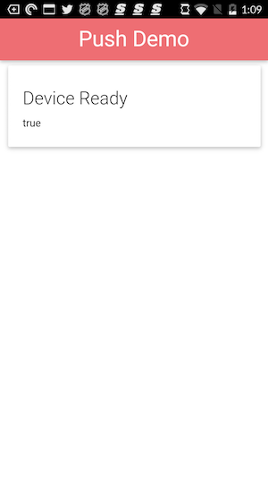

### Create a new Project
1. Create a PhoneGap project using either the PhoneGap CLI or the PhoneGap Desktop Application. For example:

        phonegap create pgpush com.yourname.workshop.push PGPush

2. Navigate into the newly created project folder:

        cd pgpush

### Replace Contents
1. The final application project we'll be using is located [here](https://github.com/macdonst/push-workshop). It contains a **solutions** folder with the completed step by step lesson to reference. If you want to work along, copy the contents or
download the [zip file for the project](https://github.com/macdonst/push-workshop/archive/master.zip) or clone it with git:

        git clone https://github.com/macdonst/push-workshop

1. Now copy the **solutions/www1**, **config.xml** and **pg-wings.png** files from the push-workshop project into your newly created project root and overwrite the default files currently there.

   > The **config.xml** file has some settings which will automatically install the project plugin dependencies, but you could optionally add them manually. The **pg-wings.png** is the default icon for this application referenced in config.xml.

### Run the Initial Application
1. Run the app using the PhoneGap CLI:

   - **From the PhoneGap CLI:** those with proper local setup can run on device with PhoneGap CLI with one of the following:

            $ phonegap run ios
            $ phonegap run ios --device
            $ phonegap run android             
            $ phonegap run android --device               

      > This option requires a mobile SDK setup. If you have Mac and Xcode you should be able to use iOS, but Android requires [additional SDK installation and setup](http://cordova.apache.org/docs/en/latest/guide/platforms/android/index.html).

2. Ensure you see the application load with and you receive a `deviceready` event.

    

<a href="index.html" class="btn btn-default"><i class="glyphicon glyphicon-chevron-left"></i> Previous</a>
<a href="module2.html" class="btn btn-default pull-right">Next <i class="glyphicon
glyphicon-chevron-right"></i></a>

