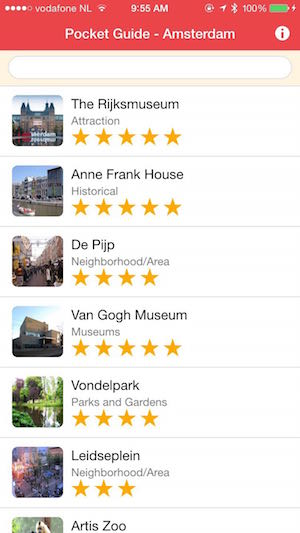
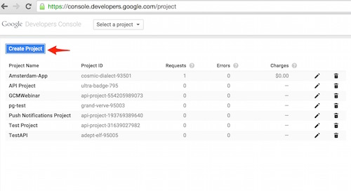
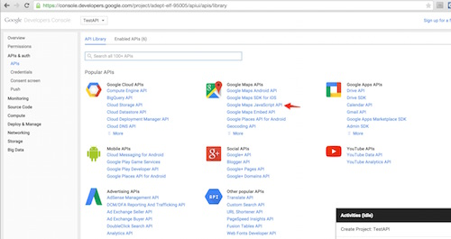
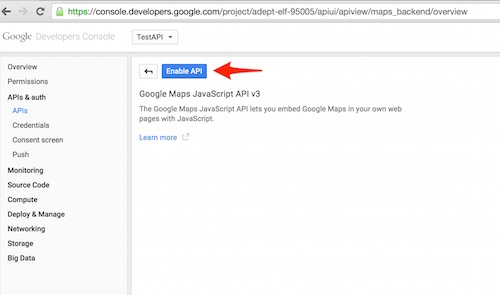
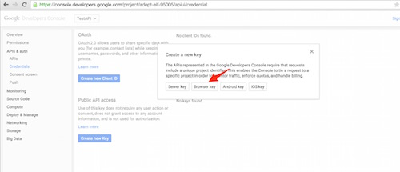

### Create a new Project
1. Create a PhoneGap project using either the PhoneGap CLI or the PhoneGap Desktop Application. For example:

        phonegap create pgpush com.yourname.workshop.push PGPush

2. Navigate into the newly created project folder:

        cd pgpush

### Replace Contents
1. The final application project we'll be using is located [here](https://github.com/macdonst/push-workshop). It contains a **solutions** folder with the completed step by step lesson to reference. If you want to work along, copy the contents or
download the [zip file for the project](https://github.com/macdonst/push-workshop/archive/master.zip) or clone it with git:

        git clone https://github.com/macdonst/push-workshop

1. Now copy the **solutions/www1**, **config.xml** and **pgbot-love.png** files from the push-workshop project into your newly created project root and overwrite the default files currently there.

   > The **config.xml** file has some settings which will automatically install the project plugin dependencies, but you could optionally add them manually. The **pgbot-love.png** is the default icon for this application referenced in config.xml.

### Run the Initial Application
1. Serve and pair with the PhoneGap Developer App from the PhoneGap CLI or PhoneGap Desktop:

   - **From PhoneGap CLI**            
     1. Run `$ phonegap serve`
     2. Connect to the URL reported from the `serve` command in the PhoneGap Developer app on a mobile device

   - **From PhoneGap Desktop**
     1. Click the play **>** button if your project is not active
     2. Connect to the URL reported from PhoneGap Desktop in the PhoneGap Developer app on a mobile device

   - **Advanced Option:** those with proper local setup can run on device/emulator with PhoneGap CLI with one of the following:

            $ phonegap run ios
            $ phonegap run ios --device
            $ phonegap run android             
            $ phonegap run android --device               

      > This option requires a mobile SDK setup. If you have Mac and Xcode you should be able to use iOS, but Android requires [additional SDK installation and setup](http://developer.android.com/sdk).

       **NOTE:** If you don't have the PhoneGap Developer App, you can still run the app in your browser by opening the index.html file in the browser, you will just have limited
       functionality.    

2. Ensure you see the application load with a listing of Amsterdam's most popular locations. Try typing in a few characters to see the filtering
 on the name.    

    

     **Note:** You'll receive an alert about using credentials for Google Maps, see the next step. We'll be adding additional features as we go along so not everything will be functional at this point.

3. (Optional) Set up a Google Maps JavaScript API Key. This project uses the Google Maps JavaScript API for adding a map to the app. If you would like to use this feature, you'll
need to [obtain a key](https://console.developers.google.com/) and insert it into the index.html script tag where it says your-dev-key-here. Ensure you've kept the `&libraries=geometry` parameter on the end, we'll
cover that later:

        

  >This is not required, you can choose to follow along by watching the demo's shown in the workshop.

  To obtain a key, first create a project, choose the Google Maps JavaScript APIs from the API listing, enable it and create a browser key for it (leave referrer blank).
  Some screenshots to guide are shown here:

   
   
   
   

<a href="index.html" class="btn btn-default"><i class="glyphicon glyphicon-chevron-left"></i> Previous</a>
<a href="module2.html" class="btn btn-default pull-right">Next <i class="glyphicon
glyphicon-chevron-right"></i></a>

