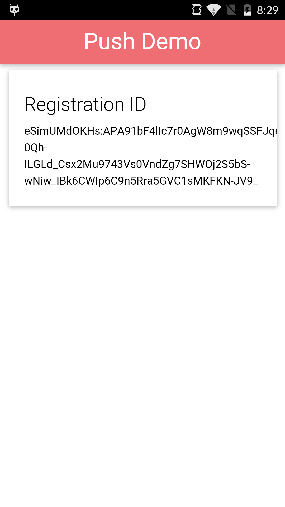

### Overview
In order for your device to receive push notifications you will need to receive a registration ID from the remote push service be it Google Cloud Messaging (GCM) or Apple Push Notification Service (APNS). We'll learn how to register for push and report that registration ID back to our application server.

## Steps
1. Initialize the PushNotification plugin and register an event handler for a `registration` event. Open the **www/js/index.js** file
and add the following into the `deviceready` handling section, **Note:** if you are testing with Android you will need to modify the `senderID` property to match yours.

        app.push = PushNotification.init({
            "android": {
                "senderID": "Your GCM ID"
            },
            "ios": {
              "sound": true,
              "vibration": true,
              "badge": true
            },
            "windows": {}
        });

        app.push.on('registration', function(data) {
            console.log("registration event: " + data.registrationId);
            document.getElementById("regId").innerHTML = data.registrationId;
            var oldRegId = localStorage.getItem('registrationId');
            if (oldRegId !== data.registrationId) {
                // Save new registration ID
                localStorage.setItem('registrationId', data.registrationId);
                // Post registrationId to your app server as the value has changed
            }
        });

        app.push.on('error', function(e) {
            console.log("push error = " + e.message);
        });

   > You may be wondering why we are checking the registration ID against one we saved in local storage. Basically, Apple or Google may refresh your registration ID so it always pays to see if the ID has changed. You can use this opportunity to remove an old ID from your app server and add the new ID.

2. Run the app using the PhoneGap CLI:

            $ phonegap run ios
            $ phonegap run ios --device
            $ phonegap run android             
            $ phonegap run android --device               

and once the device receives a registration event the application will look a like this:

## Useful Resources
1. [Apache Cordova and Remote Debugging on Android](http://geeklearning.io/apache-cordova-and-remote-debugging-on-android/) - a quick tutorial on how to setup your phone to allow remote debugging with Chrome Web Inspector.
2. [Debugging PhoneGap Apps with Safari's Web Inspector](http://phonegap-tips.com/articles/debugging-ios-phonegap-apps-with-safaris-web-inspector.html) - a quick tutorial on how to setup your phone to allow remote debugging with Safari Web Inspector.

### Dependencies

   [PhoneGap Push Plugin](https://github.com/phonegap/phonegap-plugin-push)

    $ phonegap plugin add phonegap-plugin-push

   >You won't need to specifically add it for this workshop if you used the project repo **config.xml**. If you are creating the project from scratch and using the CLI locally then use the command above.

<a href="module1.html" class="btn btn-default"><i class="glyphicon glyphicon-chevron-left"></i> Previous</a>
<a href="module3.html" class="btn btn-default pull-right">Next <i class="glyphicon
glyphicon-chevron-right"></i></a>

