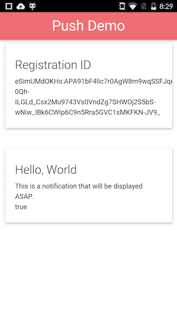
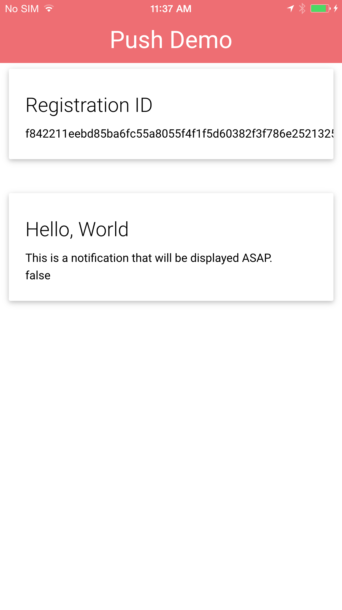

### Overview
Now that we have a registration ID we are now ready to receive our push notification in our app. In this case we'll setup our application to add a new card into our UI when a push notification is received.

## Steps
1. Open **www/js/index.js** and add the following code after the push error handler:

        app.push.on('notification', function(data) {
            console.log('notification event');
            var cards = document.getElementById("cards");
            var push = '
' +
              '
' +
              '  
' +
              '    
' +
              '      ' + data.title + '' +
              '      
' + data.message + '
' +
              '      
' + data.additionalData.foreground + '
' +
              '    
' +
              '  
' +
              ' 
' +
              '
';
            cards.innerHTML += push;
        });

2. Run the app using the PhoneGap CLI:

            $ phonegap run ios
            $ phonegap run ios --device
            $ phonegap run android             
            $ phonegap run android --device               

Now when a notification message is received while the app is the foreground your UI will automatically update.

If your app is in the background then the notification will live in the shade and once your user clicks on the notification, the notification handler will be run and your UI will be updated.

> It's very important to note that your notification handler does not **normally** run when your app is in the background. We'll discuss how to modify your app when it is in the background in a later module.

<a href="module2.html" class="btn btn-default"><i class="glyphicon glyphicon-chevron-left"></i> Previous</a>
<a href="module4.html" class="btn btn-default pull-right">Next <i class="glyphicon
glyphicon-chevron-right"></i></a>

