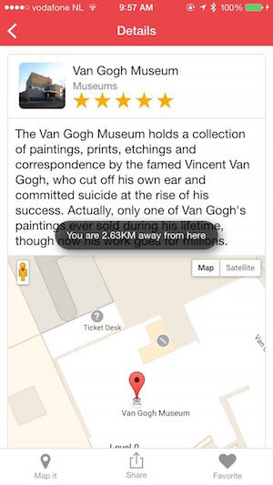

### Overview
In this lesson we'll use a couple more core PhoneGap plugins to enhance our Google Maps feature of the application. The current version of the app
to this point will display a map and mark the location using methods from the [Google Maps JavaScript v3 API](https://developers.google.com/maps/documentation/javascript/tutorial).  

### Part 1: Handle Offline
This application is dependent on a network connection currently for the Google Maps API calls (evident by the inclusion of the URL in the script tag in the index.html).
However we can add some handling to detect an offline situation using the Cordova Network Information plugin and only call to map it when there's a connection.

## Steps
1. (Optional) Test out the current handling by shutting off your network access and running the app.

2. In **www/js/ItemView.js**, add the following `if` statement as the first line in the `mapIt` function around the Google Maps existing code currently there, with
an else alert to notify the user they are offline in that event:

        if (navigator.connection && navigator.connection.type == Connection.NONE) {
            alert("Mapping requires a network connection but we have detected you are currently offline. ");
        }
        else {
            // Google maps code here 
            // var there = new google.maps.LatLng(place.latitude, place.longitude);        
            ...
        }

>This is simply checking to see if there's a connection and calling the mapping APIs if there is, otherwise just throwing an alert for 
lesson purposes. However there are events in this plugin you can use to handle when the user comes back online after being offline and vice 
versa as well as details on the specific type of connection they may have. See the 
[plugin docs](https://github.com/apache/cordova-plugin-network-information) for details. 

### Part 2: Get Location and Calculate Distance
In this part we'll use the [Cordova Geolocation](https://github.com/apache/cordova-plugin-geolocation) plugin to figure out our location to 
then determine the distance to the selected list item.

## Steps

### With Google Maps Developer Key (only if you created one in setup and can use map features)
1. While still within the `mapIt` function in **www/js/ItemView.js**, add the following code  
block into the `tilesloaded` event handler, right after the marker code and prior to the `tilesloaded` event listener removal. 
See the [solutions/www5/Item.js solution code](https://github.com/macdonst/push-workshop/blob/master/solutions/www5/js/ItemView.js) if you have any issues. 
                
        navigator.geolocation.getCurrentPosition(function (position) {
            var here = new google.maps.LatLng(position.coords.latitude, position.coords.longitude);

            // Use Google Maps Geometry library to compute distance between two points and produce a message
            var distance = (google.maps.geometry.spherical.computeDistanceBetween(here, there) / 1000).toFixed(2);
            var msg = "You are " + distance + "KM away from here";

            if (window.cordova && window.plugins && window.plugins.toast)
                window.plugins.toast.showShortCenter(msg);
            else alert(msg);

        },function(error){console.log("Error retrieving location " + error.code + " " + error.message)});
     

   >The Google Maps API details and explanation are beyond the scope of this workshop, however you can find everything you need to know 
   about the API's and code used in this application [here](https://developers.google.com/maps/documentation/javascript/tutorial). Note that for
   the distance calculation, you need to ensure the geometry parameter is included on the URL with your developer key. 
   &lt;script src="https://maps.googleapis.com/maps/api/js?key=your-dev-key-here&libraries=geometry"&gt;

2. The current location will be discovered and then used with a Google Maps Geometry function to compute the distance using a haversine formula. 
The result is then put into a message and displayed in either an alert or using a toast notification via a [3rd party plugin](https://github.com/EddyVerbruggen/Toast-PhoneGap-Plugin)
 that provides a non-blocking informational toast notification and is a nicer solution in this case.

    

### Without Google Maps Developer Key
1. If you did not create a google maps key then you can still do this lesson and get the current location using the Geolocation plugin. Add the following code into the
mapIt function outside of the Google maps code. Inserting it into the very top of the function might be a good place for trying out this feature. 

        navigator.geolocation.getCurrentPosition(function (position) {
            var here = new google.maps.LatLng(position.coords.latitude, position.coords.longitude);
            var msg = "Your current latitude is: " + position.coords.latitude +" and current longitude is " + position.coords.longitude;

            if (window.cordova && window.plugins && window.plugins.toast)
                window.plugins.toast.showShortCenter(msg);
            else alert(msg);

        },function(error){console.log("Error retrieving location " + error.code + " " + error.message)});

### Dependencies

   - [Cordova Network Information Core Plugin](https://github.com/apache/cordova-plugin-network-information)
   - [Cordova Geolocation Core Plugin](https://github.com/apache/cordova-plugin-geolocation)
   - [Toast 3rd Party Plugin](https://github.com/EddyVerbruggen/Toast-PhoneGap-Plugin)
 
        
        `$ phonegap plugin add cordova-plugin-network-information`
        `$ phonegap plugin add cordova-plugin-geolocation`
        `$ phonegap plugin add nl.x-services.plugins.toast`

   
> All of the plugins used in this module are included in the config.xml in the repo and will be added automatically if you are using it with the CLI locally.  If you're using the PhoneGap Developer App to preview your app however, you will only have the core plugins used here (network-information and geolocation), but not the toast notification plugin.
 

    

        <a href="module3.html" class="btn btn-default"><i class="glyphicon glyphicon-chevron-left"></i> Previous</a>
        <a href="module6.html" class="btn btn-default pull-right">Next <i class="glyphicon
glyphicon-chevron-right"></i></a>
    

