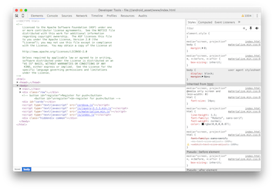
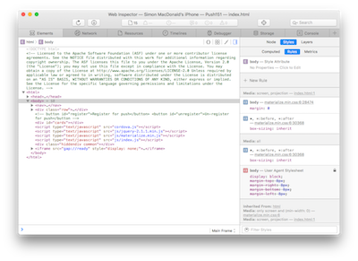

### Overview
In this lesson we'll learn how to have our notification handler run when the app is not in the foreground and without user interaction. As we mentioned in lesson 3 the notification handler is only run when the application is in the foreground or if the user taps the received notification but there is a way to signal your app to run code in the background. This is a very powerful technique which allows you to keep your app up to date.

## Steps
1. Open a remote debugging session with your application (uses the resources from lesson 2).

   
   

2. With your app in the foreground send yourself a push message using the script we worked on in lesson 4. You will notice that besides the UI of the app being updated that in the console of our debugger you will see the following output:

        notification event

3. Now put your app in the background and send another push message. You should see the message arrive in the shade area but notice there was no additional logs in the console of your debugger.

   
   

4. Click on the notification, your app should open, the UI will be updated and you'll see a new line in the console of the debugger.

   > But what we really want is for the notification event to be delivered to our application even when it is in the background

5. Open **www/js/index.js** and add replace the current push notification handler:

        app.push.on('notification', function(data) {
            console.log('notification event');
            var cards = document.getElementById("cards");
            var push = '
' +
              '
' +
              '  
' +
              '    
' +
              '      ' + data.title + '' +
              '      
' + data.message + '
' +
              '      
' + data.additionalData.foreground + '
' +
              '    
' +
              '  
' +
              ' 
' +
              '
';
            cards.innerHTML += push;

            app.push.finish(function() {
                console.log('success');
            }, function() {
                console.log('error');
            });
        });

   > Strictly speaking the call to `finish` is only required on iOS. It is a no-op on other platforms. The reason we need to do this on iOS is the OS only provides you with 30 seconds of background processing and we need to tell the OS we are done. Failure to do this may cause the OS to kill your app for mis-behaving.

6. Run the app using the PhoneGap CLI:

           $ phonegap run ios
           $ phonegap run ios --device
           $ phonegap run android  
           $ phonegap run android --device               

7. Re-establish your debugging session.

8. Now put your app into the background by pressing the home button.

9. Now we'll need to modify our push scripts to inform the device we want to do some background processing.

   - **For Android**            
     1. Open **server/gcmService.js**
     2. After the lines that add the title and body to your notification add the following line:

            message.addData('content-available', '1');

     3. Run `node gcmServer.js`

   - **For iOS**            
     1. Open **server/apnsService.js**
     2. After the line that sets `note.alert` add the following line:

            note.contentAvailable = 1;

     3. Run `node apnsServer.js`

10. As well as the notification appearing in your shade you should see the line:

        notification event

    in the debugger console.

11. Now start your app, not by clicking the push notification, instead launch the app from the app drawer. When the app starts up you'll notice the UI has already been updated with the data from the new push.

## Discussion

What we've demonstrated here is not very exciting but you can think of other uses for this background processing. Especially when you consider omitting the `title` and `body` elements from the push. If you do that the notification will not be displayed in the shade, effectively it will be a silent notification. You can use these silent background notifications to tell the app to go download some new content or in more advance cases in conjunction with [phonegap-plugin-contentsync](https://github.com/phonegap/phonegap-plugin-contentsync) you can update your app without user (or app store) interaction.

    

        <a href="module4.html" class="btn btn-default"><i class="glyphicon glyphicon-chevron-left"></i> Previous</a>
        <a href="module6.html" class="btn btn-default pull-right">Next <i class="glyphicon
glyphicon-chevron-right"></i></a>
    

