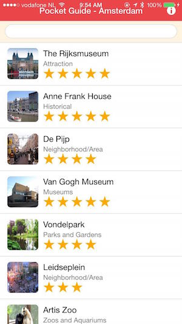
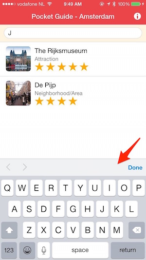
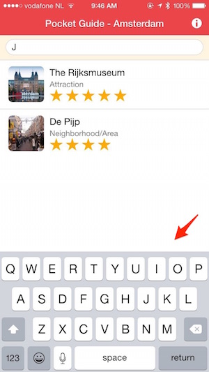
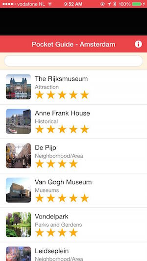

This module will take you through a couple steps to polish the application and give you some tips on configuration settings to be aware of.     

### Status Bar Handling

  In iOS7 and above the status bar overlaps the application views. As a result, the status bar text may collide with the 
  application's header text as shown in the screenshot here:
  
  

   > The status bar plugin has been implemented to fix this. It is already included in the config.xml 
   for the application but if you need to add it, use the following: `phonegap plugin add org.apache.cordova.statusbar`
    

1. There are two options for using the Status Bar plugin to fix this issue, via configuration or programmatically. 

   In either case, you can set the *overlay* setting to false to move the app content below the status bar. There are options
   to set the status bar background style and text/icons to match the app header colors. For this workshop we will set the 
   preferences in the **config.xml** file so they are loaded and applied sooner than device ready is run. The programmatic
   approach is also shown:
        
   - **Configuration (config.xml)**
    In your **config.xml** file (in the root of your project), add the following lines:
           
            <preference name="StatusBarOverlaysWebView" value="false" />
            <preference name="StatusBarBackgroundColor" value="#ec4549"/>
            <preference name="StatusBarStyle" value="lightcontent" />
            
    - **Programatically**
            In **www/js/app.js** and add the following code at the top of the `deviceready` handler:
            
              if (window.StatusBar) {
                  StatusBar.overlaysWebView(false);
                  StatusBar.backgroundColorByHexString('#ec4549');
                  StatusBar.styleLightContent();
              }
              else console.log("Status Bar plugin not found or not supported.");        
        
2. With one of these solutions in place and the Status Bar Plugin added, you should see the following with no overlap:

    
      
### Keyboard Accessory Bar 

We can suppress the accessory keyboard that pops up with the **Done** button on it as shown in this screenshot by using a custom plugin from the Ionic Framework and then use a method to hide it:

> We can use a keyboard plugin from Ionic to hide this. This plugin is already included in the config.xml for the application but if you need to add it, use the 
   following: `phonegap plugin add cordova.ionic.keyboard`  
  
1. To hide it, open **www/js/app.js** and add the following code to the `deviceready` handler:

        if (cordova.plugins.Keyboard)
            cordova.plugins.Keyboard.hideKeyboardAccessoryBar(true);
           

2. Now build the application again and test to see the result.

### Turn off WebView Bounce / Overscroll Effect
You may notice if you pull down on your app from the header bar, you will see a black space between it and the Status Bar and a 
bounce effect on iOS as shown below. 

  
You can disable this effect by setting a property in the config.xml file. 

1. In the **config.xml** in the root of your project, add the following property to the end of the preferences:

        <preference name="DisallowOverscroll" value="true" />

2. Now build and run the application again and the webview (your app) should stay in place. 

### Dependencies
- [Status Bar Plugin](https://github.com/apache/cordova-plugin-statusbar)
       
      $ phonegap plugin add cordova-plugin-statusbar

- [Ionic Keyboard Plugin](https://github.com/driftyco/ionic-plugin-keyboard)
      
      $ phonegap plugin add com.ionic.keyboard
 
 
