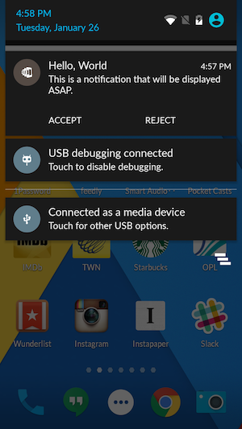
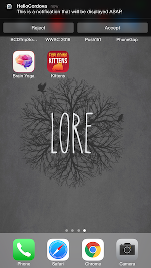
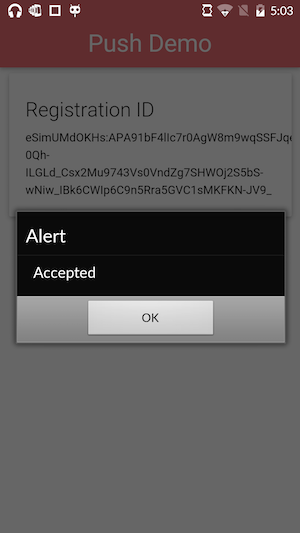
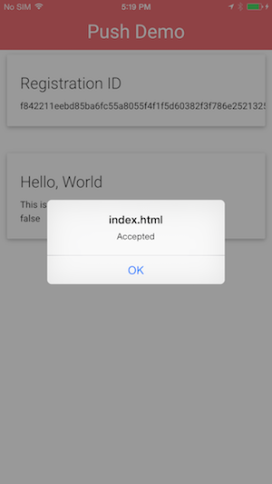

### Overview
This lesson will take you through the steps required in order to setup "action buttons" for your push notification. Action buttons are useful to provide your users with a way to easily accomplish a task directly from the push notification. The process is quite different for Android and iOS so it is worth going over in detail. For Android all you need to do is send the buttons you want to be displayed along with their callback as part of your push payload. On iOS you will need to setup all of your buttons at initialization time and then as part of your push payload let the plugin know what set of buttons you want to show.

## Steps
1. Open **www/js/index.js** and replace the current push notification initialization code:

        app.push = PushNotification.init({
            "android": {
                "senderID": "Your GCM ID"
            },
            "ios": {
              "sound": true,
              "vibration": true,
              "badge": true,
              "categories": {
                "invite": {
                    "yes": {
                        "callback": "app.accept", "title": "Accept",
                        "foreground": true, "destructive": false
                    },
                    "no": {
                        "callback": "app.reject", "title": "Reject",
                        "foreground": true, "destructive": false
                    },
                    "maybe": {
                        "callback": "app.maybe", "title": "Maybe",
                        "foreground": true, "destructive": false
                    }
                },
                "delete": {
                    "yes": {
                        "callback": "app.doDelete", "title": "Delete",
                        "foreground": true, "destructive": true
                    },
                    "no": {
                        "callback": "app.cancel", "title": "Cancel",
                        "foreground": true, "destructive": false
                    }
                }
              }
            },
            "windows": {}
        });

   > You'll notice that we've added a new parameter to the iOS object of our init code called `categories`. Each category is a named object, `invite` and `delete` in this case. These names will need to match the one you send via your payload to APNS if you want the action buttons to be displayed. Each category can have up to three buttons which must be labeled `yes`, `no` and `maybe`. In turn each of these buttons has four properties, `callback` the javascript function you want to call, `title` the label for the button, `foreground` whether or not to bring your app to the foreground and `destructive` which doesn't actually do anything destructive it just colors the button red as a warning to the user that the action may be destructive.

2. While still in **www/js/index.js** we'll add some callbacks to handle our button pushes. Nothing too crazy we'll just get the app to show an alert dialog. Scroll down to where the `onDeviceReady` method is closed and add the following code:

        ,
        accept: function() {
          alert("Accepted");
        },
        reject: function() {
          alert("Rejection!");
        },
        maybe: function() {
          alert("Maybe, I dunno. I can't tell for sure");
        }

   > Note the leading `,` is not a mistake. It's there to make sure the javascript code stays valid.

3. Run the app using the PhoneGap CLI:

          $ phonegap run ios
          $ phonegap run ios --device
          $ phonegap run android  
          $ phonegap run android --device               

4. Now we'll need to modify our push scripts to inform the device we want some action buttons.

   - **For Android**            
     1. Open **server/gcmService.js**
     2. After the lines that add the title and body to your notification comment out the following line:

            // message.addData('content-available', '1');

     3. After the line you've just commented out add:

            message.addData('actions', [
              { "icon": "accept", "title": "Accept", "callback": "app.accept"},
              { "icon": "reject", "title": "Reject", "callback": "app.reject"},
            ]);

     4. Run `node gcmServer.js`

     > The Android OS will look for your icons in your projects platform/android/res/drawable folders. See [Holly's excellent tutorial](http://devgirl.org/2013/11/12/three-hooks-your-cordovaphonegap-project-needs/) if you need help with that. Icons are strictly not required for this test.

   - **For iOS**            
     1. Open **server/apnsService.js**
     2. After the line that sets `note.alert` comment out the following line:

            // note.contentAvailable = 1;

     3. After the line you've just commented out add:

            note.category = 'invite';

     4. Run `node apnsServer.js`

   This should produce the following push notifications. On Android you may have to swipe down on the notification to reveal the buttons while on iOS you'll need to swipe down or swipe left on the notification to reveal the buttons depending on where you are viewing the notification.

   
   

5. Finally click on the 'Accept' button of the push and your app will be launched and you should see the 'Accept' alert dialog.

   
   

   Now experiment with clicking the other buttons or the main body of the notification to get the different behaviors.

   

       <a href="module5.html" class="btn btn-default"><i class="glyphicon glyphicon-chevron-left"></i> Previous</a>
       <a href="module7.html" class="btn btn-default pull-right">Next <i class="glyphicon
glyphicon-chevron-right"></i></a>
   

