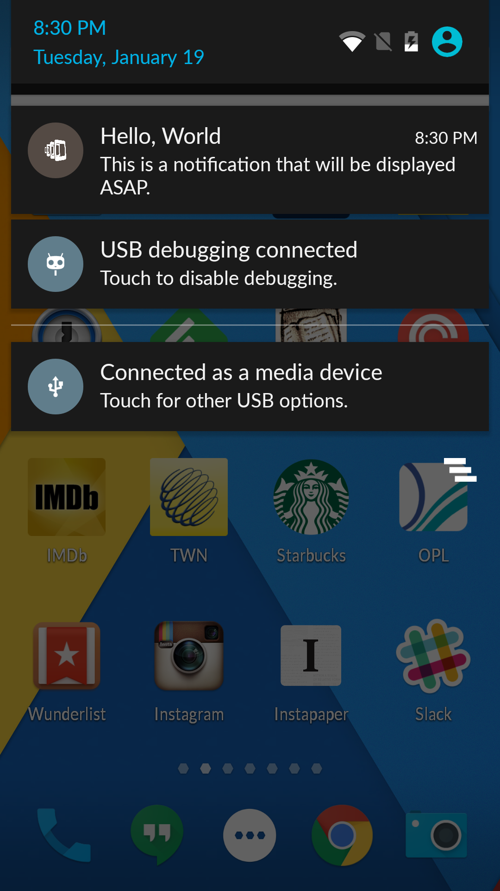
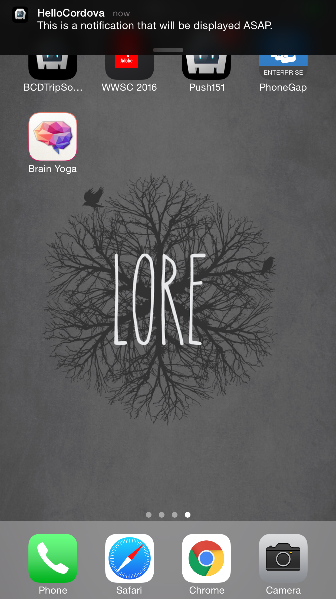
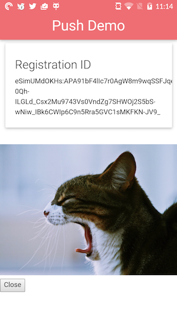
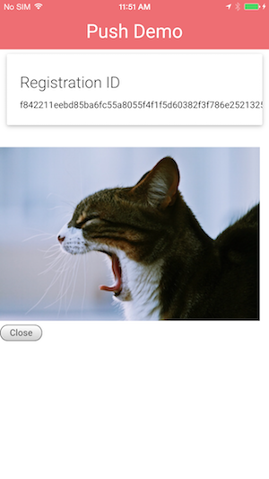
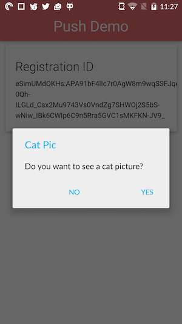
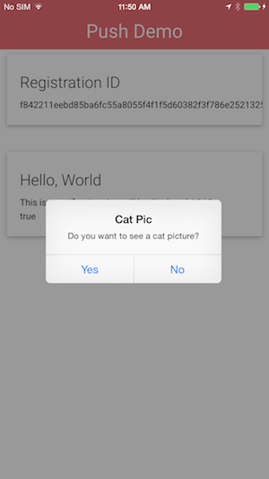

### Overview
In this lesson we'll learn how to launch to a specific location in your application based on data from the incoming push notification.

### Steps

1. Open **www/js/index.js** and add replace the current push notification handler:

        app.push.on('notification', function(data) {
         console.log('notification event');
         if (data.additionalData.url) {
           app.toggle();
         } else {
           var cards = document.getElementById("cards");
           var push = '
' +
             '
' +
             '  
' +
             '    
' +
             '      ' + data.title + '' +
             '      
' + data.message + '
' +
             '      
' + data.additionalData.foreground + '
' +
             '    
' +
             '  
' +
             ' 
' +
             '
';
           cards.innerHTML += push;
         }

         app.push.finish(function() {
             console.log('success');
         }, function() {
             console.log('error');
         });
        });

   > Notice that the `url` property is added to the `additionalData` object. If you send a property that doesn't conform to `title`, `message`, `count` or `sound` it will be placed in the `additionalData` object.

2. While still in **www/js/index.js** add the following code under the action button callbacks we added in the previous lesson:

          ,
          toggle: function (id) {
            var cats = document.querySelector("#cats");
            var cards = document.querySelector("#cards");
            if (cats.style.display === 'none') {
              cats.style.display = 'block';
              cards.style.display = 'none';
            } else {
              cats.style.display = 'none';
              cards.style.display = 'block';
            }
          }

3. Run the app using the PhoneGap CLI:

           $ phonegap run ios
           $ phonegap run ios --device
           $ phonegap run android  
           $ phonegap run android --device               

4. Put your app in the background by pressing the home button.

5. Now we'll need to modify our push scripts to include the url we want to show in our app.

   - **For Android**            
     1. Open **server/gcmService.js**
     2. After the lines that add the title and body to your notification add the following line:

            message.addData('url', 'cats');

     3. Run `node gcmServer.js`

   - **For iOS**            
     1. Open **server/apnsService.js**
     2. After the line that sets `note.alert` add the following line:

            note.payload = {'url': 'cats'};

     3. Run `node apnsServer.js`

6. You should see the message arrive in the shade area just like before.

    
    

7. Now click on the notification and when your app opens you should see the following:

    
    

   That's great as we've been able to modify the logic of our application based on information contained in the push notification.

8. Now press the `Close` button to make the yawning cat go away. While leaving the app in the foreground resend a push notification to the app using the method we talked about in step 5.

9. That the cat came back without any warning. Let's set about fixing that. Open **www/js/index.js** and add replace the current push notification handler:

        app.push.on('notification', function(data) {
         console.log('notification event');
         if (data.additionalData.url) {
           if (data.additionalData.foreground) {
             navigator.notification.confirm(
              'Do you want to see a cat picture?',
               function(buttonIndex) {
                 if (buttonIndex === 1) {
                   app.toggle();
                 }
               },
              'Cat Pic',
              ['Yes','No']
            );
           } else {
             app.toggle();
           }
         } else {
           var cards = document.getElementById("cards");
           var push = '
' +
             '
' +
             '  
' +
             '    
' +
             '      ' + data.title + '' +
             '      
' + data.message + '
' +
             '      
' + data.additionalData.foreground + '
' +
             '    
' +
             '  
' +
             ' 
' +
             '
';
           cards.innerHTML += push;
         }

         app.push.finish(function() {
             console.log('success');
         }, function() {
             console.log('error');
         });
        });

   > We are using another property that is added to the `additionalData` object called `foreground`. You don't have to explicitly send this property from your push service. The plugin itself will set `foreground` to `true` when the notification is received while the user is in your app and `false` in the app is in the background. This allows you to program different behaviors depending on how the notification was received.

10. While leaving the app in the foreground resend a push notification to the app using the method we talked about in step 3. You will now see the confirmation dialog pop up:

    
    

11. Clicking on the `Yes` button once again brings you to the yawning cat.

### Dependencies

   [Cordova Dialogs Plugin](https://github.com/apache/cordova-plugin-dialogs)

    $ phonegap plugin add cordova-plugin-dialogs

   >You won't need to specifically add it for this workshop if you used the project repo **config.xml**. If you are creating the project from scratch and using the CLI locally then use the command above.

   

       <a href="module6.html" class="btn btn-default"><i class="glyphicon glyphicon-chevron-left"></i> Previous</a>
   

